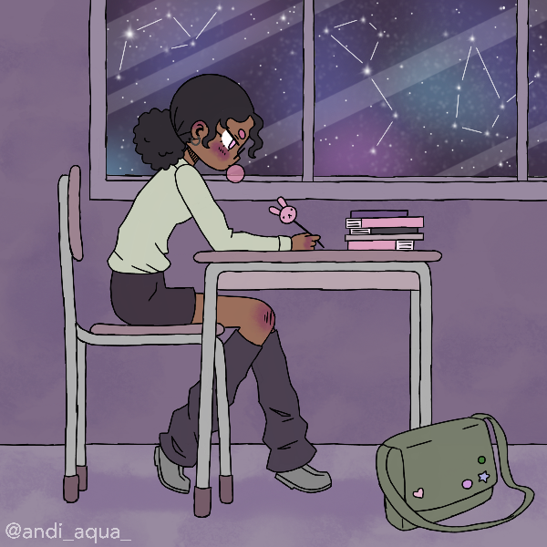

Atualmente sou estudante de Engenharia de Software na Uniasselvi e pretendo me especializar na área de dados, porém, fiz um ano de curso de Programação WEB e sou muito interessada em front-end! Também possuo formação técnica em Informática (IFRS).
Me interesso tanto por front quanto por back-end, e minhas principais linguagens são Python, PHP e JS. 
Eu estudo constantemente e procuro estar me atualizando na área, pois adoro aprender e utilizar meus conhecimentos!!

<h3 align="left">Conecte-se comigo!</h3>

)

<picture>
  <source media="(prefers-color-scheme: dark)" srcset="https://raw.githubusercontent.com/mari4souza/mari4souza/output/github-contribution-grid-snake-dark.svg">
  <source media="(prefers-color-scheme: light)" srcset="https://raw.githubusercontent.com/mari4souza/mari4souza/output/github-contribution-grid-snake.svg">
  
</picture>
  
